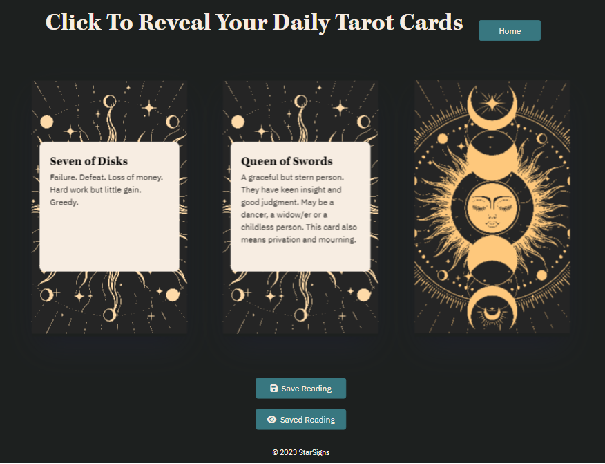
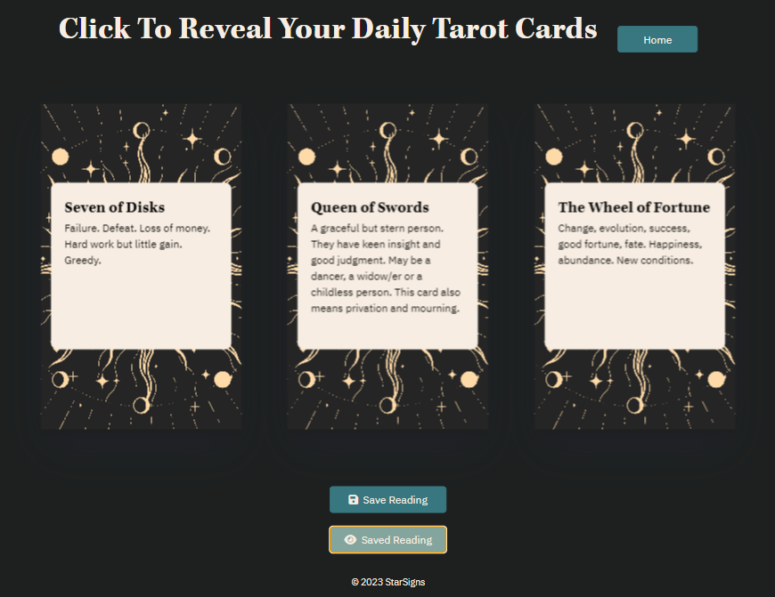

# StarSigns

## 07 Project 1: Interactive Front-End Application

For our project, we are collaborating on an application to help the user learn a bit of both astrology and astronomy! 

The two APIs we have leveraged are: **Horoscope Astrology** and **Planets Info by NewbAPI** which can both be found on RapidAPI. To tie the two together, we use the endpoint's key, "ruling_planet" from the Horoscope API, and pull a fact about the planet from the Planets Info API.

With the data pulled from the form, we find the user's zodiac sign using their inputted birth month and day.
The user’s zodiac sign will be put in as a query parameter in the Horoscope Astrology API, so that we can get the info specifically related to their zodiac sign. The different keys this returns that we will be using are: 'name', 'date range', 'symbol', 'element', 'compatibility', 'strengths', 'weaknesses', 'about', 'nature', 'health', 'love', 'relationships', and 'career'.
We will also take the value of ‘ruling_planet’, and and pass it through a function to get the associated ID that the Plants Info API takes as one of their query parameters. The Planets Info API then provides us with some scientific information about the user’s ruling planet!

The Horoscope Astrology API also has a fun end-point that we've also utilized to "Get three tarot card"s, which randomly generates 3 tarot cards for the user to read! The user can then even save their reading to view at a later time, such as if they would like to refer to it at a later time to compare their day to!


### User Story
```md
AS AN individual without much understanding of myself
I WANT to learn about my horoscope and facts related to it
SO THAT I can understand myself better and impress my peers with my knowledge.
```

### Acceptance Criteria
```md
GIVEN I am using Horoscope finder to discover more about me:
WHEN I open the website “StarSigns”,
THEN I am presented with a form asking for the inputs: name, day and month of birth.
WHEN I input my name and date of birth,
THEN I am redirected to a page telling me what my horoscope sign is along with its associated information, and a fact about its ruling planet.
WHEN I would like to make a new search, 
THEN the *HOME* button in the upper left corner will take me back to the main page where I can enter new data.
WHEN I want to gain insight about my life,
THEN I can generate 3 tarot cards to read with the "Get your tarot cards reading" button at the bottom.
WHEN I would like to save my tarot reading, 
THEN I can save the reading with the "Save Reading" button. 
WHEN I would like to view my saved reading, 
Then I can view it again using the "Saved Reading" button.
```


## Table of Contents

- [Deployment](#deployment)
- [Requirements](#requirements)
- [Usage](#usage)
- [Credits](#credits)
- [Citations](#citations)
- [License](#license)


## Deployment

Link to gitHub project: 
**https://github.com/kemcclen/StarSigns**


## Requirements

Here are the requirements for the Project:
### Project Requirements
* Use a CSS framework ~~other than Bootstrap~~.
* Be deployed to GitHub Pages.
* Be interactive (i.e., accept and respond to user input).
* Use at least two [server-side APIs](https://coding-boot-camp.github.io/full-stack/apis/api-resources).
* Does not use alerts, confirms, or prompts (use modals).
* Use client-side storage to store persistent data.
* Be responsive.
* Have a polished UI.
* Have a clean repository that meets quality coding standards (file structure, naming conventions, follows best practices for class/id naming conventions, indentation, quality comments, etc.).
* Have a quality README (with unique name, description, technologies used, screenshot, and link to deployed application).

### Presentation Requirements
* Elevator pitch: a one minute description of your application
* Concept: What is your user story? What was your motivation for development?
* Process: What were the technologies used? How were tasks and roles broken down and assigned? What challenges did you encounter? What were your successes?
* Demo: Show your stuff!
* Directions for Future Development
* Links to the deployed application and the GitHub repository


## Usage


Welcome to StarSigns, a horoscope webpage that teaches you about astrology and astronomy! 


To start, please insert your name, birth date and birth month, then click submit. 


You'll then be direct to a page with information about your horoscope.


And shown a fact about your ruling planet!  
The layout also changes on different screen sizes.




You can also get your tarot cards read! Please click on each card to flip them over. 



You can save your reading, by clicking the "Save Reading" button. When you would like to refer to it again later, you can click "Saved Reading" to show the previous cards again. Clicking the "Home" button at any point, will bring you to a refreshed main page. 


## Credits

- jaychan0125  - Joyce Chan
- julie-mac  - Julie Macpherson
- kemcclen  - Katharine McClenaghan
- matthew-millard  - Matthew Millard 
- shok1to  - Shoko Takahashi


## Citations

Maqsood, A., Moatar, T., Krishna, &amp; Zhang, S. (2023). Lectures. 


## License

Licensed under the MIT license.

---
